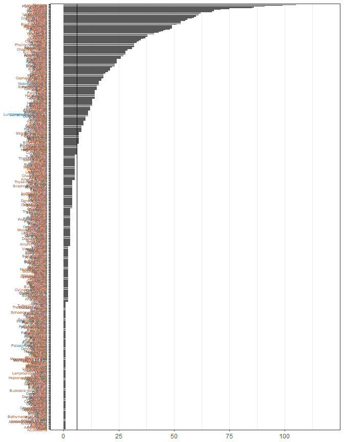

```r
knitr::opts_chunk$set(message = F, warning = F)

library(tidyverse)
library(vegan)
library(ggmap)
library(GGally)
library(ggdendro)
library(dendextend)
library(tibble)
library(d3heatmap)
library(NbClust)
library(ggord)

data(bio)
data(env)

# globals
rrs <- 2
evvrs <- c('StationWaterDepth', 'Latitude', 'Clay', 'Sand', 'Silt', 'TN', 'TOC')
```

## Exploratory plots


```r
bbx <- make_bbox(lon = env$Longitude, lat = env$Latitude, f = 0.2)
bsmap <- get_stamenmap(bbx, maptype = "toner-lite", zoom = 9)

envloc <- env %>% 
  select(StationID, Latitude, Longitude, TOC) %>% 
  group_by(StationID, Latitude, Longitude) %>% 
  summarise(TOC = mean(TOC, na.rm = T)) %>% 
  unique
toplo <- bio %>% 
  group_by(SampleID, StationID) %>% 
  summarise(rich = length(Taxon)) %>% 
  group_by(StationID) %>% 
  summarise(rich = mean(rich)) %>% 
  ungroup %>% 
  mutate(rich = round(rich, 0)) %>% 
  left_join(envloc, by = 'StationID')

ggmap(bsmap) +   
  geom_point(data = toplo, aes(x = Longitude, y = Latitude, size = rich, colour = TOC), alpha = 0.6) + 
  theme_bw()
```

<!-- -->


```r
toplo <- bio %>% 
  group_by(SampleID) %>% 
  summarise(rich = length(Taxon)) %>% 
  ungroup %>% 
  left_join(env, by = c('SampleID')) %>% 
  select(-SampleID, -StationID, -Year)

ggpairs(toplo)
```

<!-- -->

## Clustering and ordination {.tabset}

### All

Clustering with Ward's method:

```r
# abundance data in a matrix
dat <- bio %>% 
  select(SampleID, Taxon, Abun) %>% 
  group_by(Taxon) %>% 
  mutate(
    valt = log(1 + Abun)
  ) %>% 
  ungroup %>% 
  select(-Abun) %>% 
  spread(Taxon, valt, fill = 0) %>% 
  data.frame %>% 
  remove_rownames %>% 
  column_to_rownames('SampleID')

grps <- NbClust(dat, distance = 'euclidean', method = 'ward.D2', index = 'duda')
ngrps <- grps$Best.nc[1]

# cluster with euclidean dissim, ward grouping
dend <- dat %>% 
  vegdist(method = 'euclidean') %>% 
  hclust(method = 'ward.D2')

p1 <- dend %>% 
  as.dendrogram %>% 
  set("branches_k_color", k = ngrps) %>% 
  set("labels_colors", k = ngrps) %>% 
  set("labels_cex", 0.4) 
circlize_dendrogram(p1) 
```

<!-- -->

Principal components analysis:

```r
# groups as data frame
grps <- data.frame(grps = grps$Best.partition) %>% 
  rownames_to_column(var = 'SampleID')

# colors from dendextend as data frame
cols <- labels_colors(p1) %>% 
  data.frame(col = ., stringsAsFactors = F) %>% 
  rownames_to_column(var = 'SampleID') %>% 
  left_join(., grps, by = 'SampleID') %>% 
  dplyr::select(grps, col) %>% 
  unique %>% 
  arrange(grps)

datall <- dat %>%
  prcomp(center = F, scale. = F)

ggord(datall, grp_in = as.character(grps$grps), axes = c("1", "2"), arrow = NULL, 
           txt = NULL, size = 2, cols = cols$col, ellipse = F, hull = T)
```

<!-- -->

```r
ggord(datall, grp_in = as.character(grps$grps), axes = c("2", "3"), arrow = NULL, 
           txt = NULL, size = 2, cols = cols$col, ellipse = F, hull = T)
```

<!-- -->

```r
ggord(datall, grp_in = as.character(grps$grps), axes = c("1", "3"), arrow = NULL, 
           txt = NULL, size = 2, cols = cols$col, ellipse = F, hull = T)
```

<!-- -->

Alternative clustering and meta-MDS:

```r
# format 
dat <- bio %>% 
  select(SampleID, Taxon, Abun) %>% 
  spread(Taxon, Abun, fill = 0) %>% 
  data.frame %>% 
  remove_rownames %>% 
  column_to_rownames('SampleID')

# clustering
cls <- dat %>% 
  decostand(method = 'log') %>% 
  vegdist(method = 'bray') %>% 
  hclust(method = 'average') %>% 
  cutree(k = 3)

# ordination
ord <- dat %>% 
  decostand(method = 'log') %>% 
  metaMDS(distance = 'bray', trace = 0, autotransform = F, k = 3)
ord
```

```
## 
## Call:
## metaMDS(comm = ., distance = "bray", k = 3, autotransform = F,      trace = 0) 
## 
## global Multidimensional Scaling using monoMDS
## 
## Data:     . 
## Distance: bray 
## 
## Dimensions: 3 
## Stress:     0.1893024 
## Stress type 1, weak ties
## No convergent solutions - best solution after 20 tries
## Scaling: centring, PC rotation, halfchange scaling 
## Species: expanded scores based on '.'
```

```r
ggord(ord, grp_in = as.character(cls), axes = c("1", "2"), arrow = NULL, txt = NULL, size = 4, 
      obslab = F, ellipse = F, hull = T, alpha = 0.8)
```

<!-- -->

```r
ggord(ord, grp_in = as.character(cls), axes = c("2", "3"), arrow = NULL, txt = NULL, size = 4, 
      obslab = F, ellipse = F, hull = T, alpha = 0.8)
```

<!-- -->

```r
ggord(ord, grp_in = as.character(cls), axes = c("1", "3"), arrow = NULL, txt = NULL, size = 4, 
      obslab = F, ellipse = F, hull = T, alpha = 0.8)
```

<!-- -->

Spatial clustering (Ward's groups):

```r
bbx <- make_bbox(lon = env$Longitude, lat = env$Latitude, f = 0.2)
bsmap <- get_stamenmap(bbx, maptype = "toner-lite", zoom = 8)

envloc <- env %>% 
  select(StationID, Latitude, Longitude) %>% 
  unique
toplo <- bio %>% 
  select(SampleID, StationID) %>% 
  left_join(grps, by = 'SampleID') %>% 
  left_join(envloc, by = 'StationID')

ggmap(bsmap) +   
  geom_point(data = toplo, aes(x = Longitude, y = Latitude, colour = factor(grps)), 
             alpha = 0.6, size = 2) + 
  theme_bw()
```

<!-- -->

Redundancy analysis:

```r
# abundance data in a matrix
datbio <- bio %>% 
  select(SampleID, Taxon, Abun) %>% 
  group_by(Taxon) %>% 
  mutate(
    valt = log(1 + Abun)
  ) %>% 
  ungroup %>% 
  select(-Abun) %>% 
  spread(Taxon, valt, fill = 0) %>% 
  data.frame %>% 
  arrange(SampleID) %>% 
  remove_rownames %>% 
  column_to_rownames('SampleID')

datenv <- env[, c('SampleID', evvrs)] %>%
  gather('var', 'val', -SampleID) %>% 
  group_by(var) %>% 
  mutate(val = ifelse(is.na(val), mean(val, na.rm = T), val)) %>% 
  ungroup %>% 
  spread(var, val) %>% 
  filter(SampleID %in% row.names(datbio)) %>% 
  arrange(SampleID) %>% 
  data.frame(stringsAsFactors = F) %>% 
  remove_rownames %>% 
  column_to_rownames('SampleID')

ord <- rda(datbio, datenv)

ggord(ord, grp_in = as.character(grps$grps), axes = c('1', '2'), vec_ext = 0.2, ptslab = T, 
      parse = T, hull = T, ellipse = F)
```

<!-- -->

```r
ggord(ord, grp_in = as.character(grps$grps), axes = c('2', '3'), vec_ext = 0.2, ptslab = T, 
      parse = T, hull = T, ellipse = F)
```

<!-- -->

```r
ggord(ord, grp_in = as.character(grps$grps), axes = c('1', '3'), vec_ext = 0.2, ptslab = T, 
      parse = T, hull = T, ellipse = F)
```

<!-- -->

### Removing rare taxa

Clustering with Ward's method:

```r
# abundance data in a matrix
dat <- bio %>% 
  select(SampleID, Taxon, Abun) %>% 
  group_by(Taxon) %>% 
  mutate(n = length(Taxon)) %>% 
  filter(n > rrs) %>% 
  mutate(
    valt = log(1 + Abun)
  ) %>% 
  ungroup %>% 
  select(-Abun, -n) %>% 
  spread(Taxon, valt, fill = 0) %>% 
  data.frame %>% 
  remove_rownames %>% 
  column_to_rownames('SampleID')

grps <- NbClust(dat, distance = 'euclidean', method = 'ward.D2', index = 'duda')
ngrps <- grps$Best.nc[1]

# cluster with euclidean dissim, ward grouping
dend <- dat %>% 
  vegdist(method = 'euclidean') %>% 
  hclust(method = 'ward.D2')

p1 <- dend %>% 
  as.dendrogram %>% 
  set("branches_k_color", k = ngrps) %>% 
  set("labels_colors", k = ngrps) %>% 
  set("labels_cex", 0.4) 
circlize_dendrogram(p1) 
```

<!-- -->

Principal components analysis:

```r
# groups as data frame
grps <- data.frame(grps = grps$Best.partition) %>% 
  rownames_to_column(var = 'SampleID')

# colors from dendextend as data frame
cols <- labels_colors(p1) %>% 
  data.frame(col = ., stringsAsFactors = F) %>% 
  rownames_to_column(var = 'SampleID') %>% 
  left_join(., grps, by = 'SampleID') %>% 
  dplyr::select(grps, col) %>% 
  unique %>% 
  arrange(grps)

datall <- dat %>%
  prcomp(center = F, scale. = F)

ggord(datall, grp_in = as.character(grps$grps), axes = c("1", "2"), arrow = NULL, 
           txt = NULL, size = 2, cols = cols$col, ellipse = F, hull = T)
```

<!-- -->

```r
ggord(datall, grp_in = as.character(grps$grps), axes = c("2", "3"), arrow = NULL, 
           txt = NULL, size = 2, cols = cols$col, ellipse = F, hull = T)
```

<!-- -->

```r
ggord(datall, grp_in = as.character(grps$grps), axes = c("1", "3"), arrow = NULL, 
           txt = NULL, size = 2, cols = cols$col, ellipse = F, hull = T)
```

<!-- -->

Alternative clustering and meta-MDS:

```r
# format 
dat <- bio %>% 
  select(SampleID, Taxon, Abun) %>% 
  group_by(Taxon) %>% 
  mutate(n = length(Taxon)) %>% 
  filter(n > rrs) %>% 
  select(-n) %>% 
  spread(Taxon, Abun, fill = 0) %>% 
  data.frame %>% 
  remove_rownames %>% 
  column_to_rownames('SampleID')

# clustering
cls <- dat %>% 
  decostand(method = 'log') %>% 
  vegdist(method = 'bray') %>% 
  hclust(method = 'average') %>% 
  cutree(k = 3)

# ordination
ord <- dat %>% 
  decostand(method = 'log') %>% 
  metaMDS(distance = 'bray', trace = 0, autotransform = F, k = 7)
ord
```

```
## 
## Call:
## metaMDS(comm = ., distance = "bray", k = 7, autotransform = F,      trace = 0) 
## 
## global Multidimensional Scaling using monoMDS
## 
## Data:     . 
## Distance: bray 
## 
## Dimensions: 7 
## Stress:     0.1037129 
## Stress type 1, weak ties
## No convergent solutions - best solution after 20 tries
## Scaling: centring, PC rotation, halfchange scaling 
## Species: expanded scores based on '.'
```

```r
ggord(ord, grp_in = as.character(cls), axes = c("1", "2"), arrow = NULL, txt = NULL, size = 4, 
      obslab = F, ellipse = F, hull = T, alpha = 0.8)
```

<!-- -->

```r
ggord(ord, grp_in = as.character(cls), axes = c("2", "3"), arrow = NULL, txt = NULL, size = 4, 
      obslab = F, ellipse = F, hull = T, alpha = 0.8)
```

<!-- -->

```r
ggord(ord, grp_in = as.character(cls), axes = c("1", "3"), arrow = NULL, txt = NULL, size = 4, 
      obslab = F, ellipse = F, hull = T, alpha = 0.8)
```

<!-- -->

Spatial clustering (Ward's groups):

```r
bbx <- make_bbox(lon = env$Longitude, lat = env$Latitude, f = 0.2)
bsmap <- get_stamenmap(bbx, maptype = "toner-lite", zoom = 8)

envloc <- env %>% 
  select(StationID, Latitude, Longitude) %>% 
  unique
toplo <- bio %>% 
  select(SampleID, StationID) %>% 
  left_join(grps, by = 'SampleID') %>% 
  left_join(envloc, by = 'StationID')

ggmap(bsmap) +   
  geom_point(data = toplo, aes(x = Longitude, y = Latitude, colour = factor(grps)), 
             alpha = 0.6, size = 2) + 
  theme_bw()
```

<!-- -->

Redundancy analysis:

```r
# abundance data in a matrix
datbio <- bio %>% 
  select(SampleID, Taxon, Abun) %>% 
  group_by(Taxon) %>% 
  mutate(n = length(Taxon)) %>% 
  filter(n > rrs) %>% 
  mutate(
    valt = log(1 + Abun)
  ) %>% 
  ungroup %>% 
  select(-Abun, -n) %>% 
  spread(Taxon, valt, fill = 0) %>% 
  data.frame %>% 
  arrange(SampleID) %>% 
  remove_rownames %>% 
  column_to_rownames('SampleID')

datenv <- env[, c('SampleID', evvrs)] %>%
  gather('var', 'val', -SampleID) %>% 
  group_by(var) %>% 
  mutate(val = ifelse(is.na(val), mean(val, na.rm = T), val)) %>% 
  ungroup %>% 
  spread(var, val) %>% 
  filter(SampleID %in% row.names(datbio)) %>% 
  arrange(SampleID) %>% 
  data.frame(stringsAsFactors = F) %>% 
  remove_rownames %>% 
  column_to_rownames('SampleID')

ord <- rda(datbio, datenv)

ggord(ord, grp_in = as.character(grps$grps), axes = c('1', '2'), vec_ext = 0.2, ptslab = T, 
      parse = T, hull = T, ellipse = F)
```

<!-- -->

```r
ggord(ord, grp_in = as.character(grps$grps), axes = c('2', '3'), vec_ext = 0.2, ptslab = T, 
      parse = T, hull = T, ellipse = F)
```

<!-- -->

```r
ggord(ord, grp_in = as.character(grps$grps), axes = c('1', '3'), vec_ext = 0.2, ptslab = T, 
      parse = T, hull = T, ellipse = F)
```

<!-- -->
